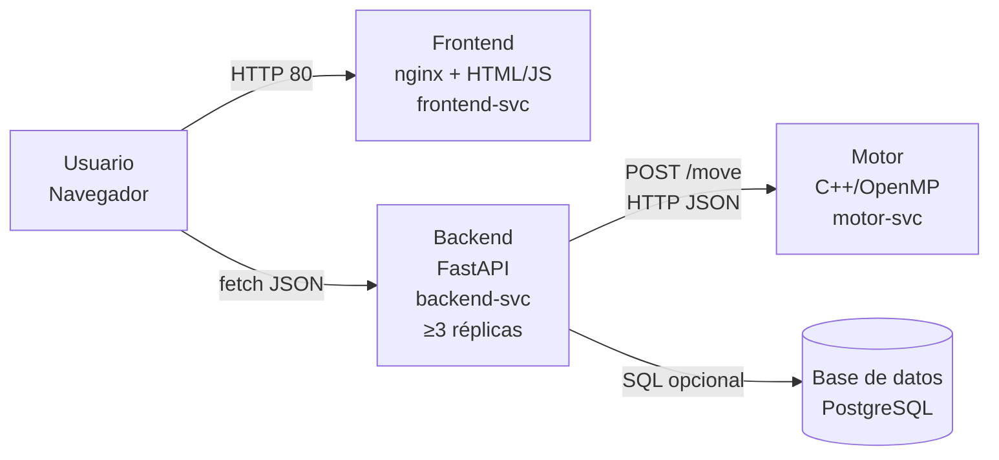
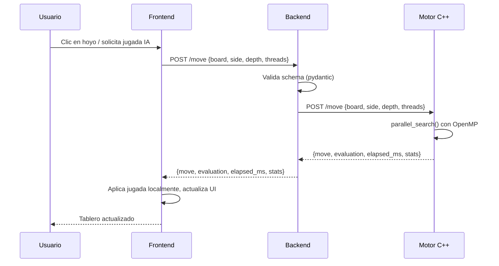

# 01 — Arquitectura del Sistema

## Visión general

El sistema implementa el juego Mancala (Kalah) como una aplicación distribuida de **4 contenedores independientes**, comunicados exclusivamente por red interna del clúster. Ningún componente comparte proceso o sistema de archivos con otro.

## Diagrama de orquestación



## Componentes

| Componente | Tecnología | Puerto | Responsabilidad |
|------------|-----------|--------|----------------|
| **Motor** | C++ 17 + OpenMP | 8001 | Minimax + Alfa–Beta paralelo |
| **Backend** | Python 3.12 + FastAPI | 8000 | Validación, proxy, CORS |
| **Frontend** | nginx 1.25 + HTML/JS | 80 | UI del juego |
| **DB** (opcional) | PostgreSQL | 5432 | Persistencia de partidas |

## Separación estricta de contenedores

- El motor **nunca** comparte proceso con el backend (sin pybind11, sin ctypes)
- El backend **nunca** sirve archivos estáticos del frontend
- Cada componente tiene su propio `Dockerfile` y se construye independientemente

## Contrato API REST

### Reglas generales

- `Content-Type: application/json; charset=utf-8` en todas las peticiones y respuestas
- Schemas definidos con **pydantic v2** (FastAPI)
- El tablero se serializa como **array de 14 enteros** en orden canónico:
  - `[0..5]` → hoyos P0, `[6]` → kalaha P0
  - `[7..12]` → hoyos P1, `[13]` → kalaha P1

### Códigos HTTP

| Código | Significado |
|--------|------------|
| `200` | Éxito |
| `400` | Entrada inválida del cliente |
| `422` | Fallo de validación del schema (pydantic) |
| `500` | Error interno |
| `503` | Motor no disponible |

### Endpoints mínimos

#### `POST /move`

**Request:**
```json
{
  "board":   [4,4,4,4,4,4,0,4,4,4,4,4,4,0],
  "side":    0,
  "depth":   8,
  "threads": 4
}
```

**Response `200`:**
```json
{
  "move":         2,
  "evaluation":   3,
  "elapsed_ms":   124,
  "stats":        {"nodes": 1845210, "prunes": 312088},
  "threads_used": 4
}
```

#### `GET /healthz`
```json
{"status": "ok"}
```

#### `GET /readyz`
```json
{"status": "ok"}
```
Retorna `503` si el motor no responde.

#### `GET /metrics`
Texto plano en formato Prometheus:
```
mancala_requests_total 42
mancala_nodes_total 73481920
mancala_prunes_total 12034560
mancala_elapsed_ms_total 5240
```

## Política CORS

El backend configura CORS explícitamente con `CORSMiddleware` de FastAPI:

```python
app.add_middleware(
    CORSMiddleware,
    allow_origins=[
        "http://localhost:8080",
        "https://mancala.YOURDOMAIN.cloud",
    ],
    allow_methods=["GET", "POST", "OPTIONS"],
    allow_headers=["Content-Type"],
)
```

- **No** se usa el comodín `"*"` en producción
- Los orígenes se configuran vía variable de entorno `CORS_ORIGINS`
- Las peticiones preflight `OPTIONS` son manejadas automáticamente por el middleware
- Solo se permiten `GET`, `POST` y `OPTIONS`

## Flujo de una jugada IA


