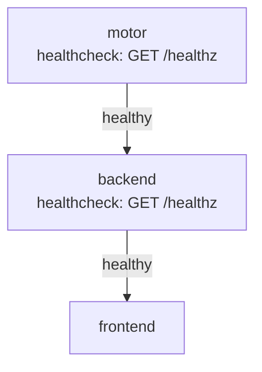

# 04 — Despliegue Local

## Dockerfiles

### Motor (`motor/Dockerfile`)

```dockerfile
FROM gcc:13 AS builder
RUN apt-get update && apt-get install -y cmake libssl-dev ca-certificates
WORKDIR /build
COPY . .
RUN cmake -B build -DCMAKE_BUILD_TYPE=Release && \
    cmake --build build --parallel $(nproc) --target mancala_server mancala_bench test_board
RUN cd build && ctest --output-on-failure
FROM debian:bookworm-slim
RUN apt-get update && apt-get install -y libgomp1 ca-certificates
WORKDIR /app
COPY --from=builder /build/build/mancala_server .
COPY --from=builder /build/build/mancala_bench  .
COPY --from=builder /build/tests/suite.txt       tests/
ENV MOTOR_PORT=8001
ENV OMP_NUM_THREADS=4
EXPOSE 8001
CMD ["./mancala_server"]
```

- Multi-stage build: la imagen final no incluye gcc ni cmake
- Los tests unitarios se ejecutan durante el build (`ctest`)
- `libgomp1` es la única dependencia runtime de OpenMP

### Backend (`backend/Dockerfile`)

```dockerfile
FROM python:3.12-slim
WORKDIR /app
COPY requirements.txt .
RUN pip install --no-cache-dir -r requirements.txt
COPY app/ app/
ENV MOTOR_URL=http://motor-svc:8001
ENV CORS_ORIGINS=http://localhost:8080,http://frontend-svc
EXPOSE 8000
CMD ["uvicorn", "app.main:app", "--host", "0.0.0.0", "--port", "8000"]
```

### Frontend (`frontend/Dockerfile`)

```dockerfile
FROM nginx:1.25-alpine
COPY index.html  /usr/share/nginx/html/
COPY style.css   /usr/share/nginx/html/
COPY game.js     /usr/share/nginx/html/
COPY nginx.conf  /etc/nginx/conf.d/default.conf
EXPOSE 80
```

## Docker Compose

El archivo [`docker-compose.yml`](../docker-compose.yml) en la raíz levanta toda la aplicación con un solo comando:

```bash
docker compose up --build
```

### Puntos de acceso

| Componente | URL local |
|-----------|-----------|
| Frontend | http://localhost:8080 |
| Backend  | http://localhost:8000 |
| Motor    | http://localhost:8001 |

### Dependencias y health checks



- El backend solo inicia cuando el motor está `healthy`
- El frontend solo inicia cuando el backend está `healthy`
- Los health checks hacen retry con `interval=10s, retries=5`

## Kubernetes Local (kind / minikube)

### Prerequisitos

```bash
# kind
curl -Lo ./kind https://kind.sigs.k8s.io/dl/v0.22.0/kind-linux-amd64
chmod +x ./kind && sudo mv ./kind /usr/local/bin/kind

# kubectl
curl -LO "https://dl.k8s.io/release/$(curl -sL https://dl.k8s.io/release/stable.txt)/bin/linux/amd64/kubectl"
chmod +x kubectl && sudo mv kubectl /usr/local/bin/
```

### Despliegue desde cero

```bash
# 1. Crear clúster
kind create cluster --name mancala

# 2. Cargar imágenes locales (si no están en registro)
kind load docker-image mancala-motor:local   --name mancala
kind load docker-image mancala-backend:local --name mancala
kind load docker-image mancala-frontend:local --name mancala

# 3. Aplicar manifiestos
kubectl apply -f deploy/local/k8s/configmap.yaml
kubectl apply -f deploy/local/k8s/motor-deployment.yaml
kubectl apply -f deploy/local/k8s/backend-deployment.yaml
kubectl apply -f deploy/local/k8s/frontend-deployment.yaml

# 4. Verificar estado
kubectl get pods,svc,deploy

# Frontend disponible en http://localhost:30080
# Backend disponible en http://localhost:30000
```

### Diagrama Kubernetes local

```mermaid
flowchart TB
    subgraph Cluster kind
        subgraph Namespace: default
            CM[ConfigMap\nmancala-config]
            MD[Deployment motor\n1 réplica]
            MS[Service motor-svc\nClusterIP:8001]
            BD[Deployment backend\n3 réplicas]
            BS[Service backend-svc\nNodePort:30000]
            FD[Deployment frontend\n1 réplica]
            FS[Service frontend-svc\nNodePort:30080]
        end
    end
    U[Usuario] -->|:30080| FS --> FD
    U -->|:30000| BS --> BD
    BD --> MS --> MD
    CM -.->|env vars| MD
    CM -.->|env vars| BD
```

### Manifiestos

| Archivo | Contenido |
|---------|-----------|
| [`configmap.yaml`](../deploy/local/k8s/configmap.yaml) | `OMP_NUM_THREADS`, `CORS_ORIGINS`, etc. |
| [`motor-deployment.yaml`](../deploy/local/k8s/motor-deployment.yaml) | Deployment + Service ClusterIP |
| [`backend-deployment.yaml`](../deploy/local/k8s/backend-deployment.yaml) | Deployment 3 réplicas + Service NodePort |
| [`frontend-deployment.yaml`](../deploy/local/k8s/frontend-deployment.yaml) | Deployment + Service NodePort |

Todos los Deployments incluyen:
- `livenessProbe` → `GET /healthz`
- `readinessProbe` → `GET /readyz` (backend) / `GET /healthz` (motor y frontend)
- `requests` y `limits` de CPU y memoria
