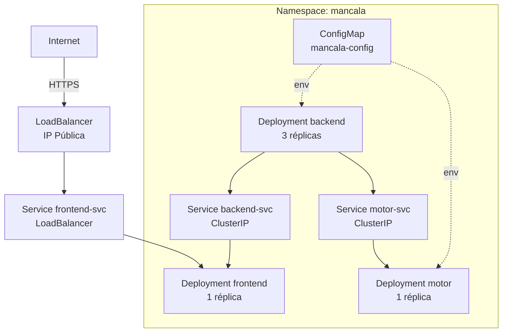

# 05 — Despliegue en la Nube

## Proveedor elegido

**Google Kubernetes Engine (GKE)** — Google Cloud Platform

Alternativa válida: AWS EKS o Azure AKS con los mismos manifiestos YAML.

## Toda la configuración en YAML versionado

Todos los manifiestos están en [`deploy/cloud/`](../deploy/cloud/) y se aplican con:

```bash
# Autenticación GCP
gcloud auth login
gcloud container clusters get-credentials mancala-cluster --region us-central1

# Aplicar namespace primero
kubectl apply -f deploy/cloud/namespace.yaml

# Aplicar todos los manifiestos
kubectl apply -f deploy/cloud/configmap.yaml
kubectl apply -f deploy/cloud/motor-deployment.yaml
kubectl apply -f deploy/cloud/backend-deployment.yaml
kubectl apply -f deploy/cloud/frontend-deployment.yaml
```

**No se usó la consola web de GCP** para ninguna configuración de la aplicación.

## Diagrama de orquestación en la nube



## Imágenes en registro con tag inmutable

Las imágenes se publican en GitHub Container Registry (GHCR) con tag basado en el SHA del commit:

```
ghcr.io/OWNER/mancala-motor:abc1234
ghcr.io/OWNER/mancala-backend:abc1234
ghcr.io/OWNER/mancala-frontend:abc1234
```

**No se usa `latest`** en producción — el tag `latest` es mutable y rompe la reproducibilidad del despliegue.

Para actualizar el despliegue en la nube:
```bash
# Actualizar la imagen en los manifiestos YAML y hacer apply
kubectl set image deployment/backend \
  backend=ghcr.io/OWNER/mancala-backend:NUEVO_SHA -n mancala
```

## Backend replicado (≥ 3 réplicas)

El Deployment del backend tiene `replicas: 3`. El Service `backend-svc` balancea el tráfico entre réplicas usando el algoritmo round-robin de kube-proxy.

```bash
kubectl get deployment backend -n mancala
# NAME      READY   UP-TO-DATE   AVAILABLE
# backend   3/3     3            3
```

## Recursos declarados por contenedor

| Componente | CPU request | CPU limit | Mem request | Mem limit |
|-----------|------------|-----------|-------------|-----------|
| motor | 1000m | 4000m | 512Mi | 1Gi |
| backend | 250m | 500m | 128Mi | 256Mi |
| frontend | 50m | 200m | 32Mi | 64Mi |

### Justificación

- **Motor:** CPU alta porque ejecuta búsqueda paralela con OpenMP. El límite de 4 CPUs permite hasta `OMP_NUM_THREADS=4` con un hilo por CPU virtual.
- **Backend:** CPU moderada. FastAPI es I/O-bound (espera respuesta del motor). La memoria es suficiente para el intérprete Python + pydantic.
- **Frontend:** mínimo. nginx solo sirve 3 archivos estáticos de ~50 KB total.

## Evidencia de despliegue en nube

**URL pública:** http://35.202.56.120

**Clúster:** `mancala-cluster` — GKE, zona `us-central1-a`, proyecto `mancala-uvalle-2026`  
**Nodos:** 2 × `e2-small` (2 vCPU, 2 GB RAM c/u)

```bash
kubectl get pods,svc,deploy -n mancala
```

```
NAME                            READY   STATUS    RESTARTS   AGE
pod/backend-6c4d55959c-mdhw5    1/1     Running   0          40h
pod/frontend-7dd766fc74-6jp7v   1/1     Running   0          40h
pod/motor-7458d8fc97-z4hsc      1/1     Running   0          10m

NAME                  TYPE           CLUSTER-IP       EXTERNAL-IP      PORT(S)
service/backend-svc   ClusterIP      34.118.x.x       <none>           8000/TCP
service/frontend-svc  LoadBalancer   34.118.227.14    35.202.56.120    80:31117/TCP
service/motor-svc     ClusterIP      34.118.x.x       <none>           8001/TCP

NAME                       READY   UP-TO-DATE   AVAILABLE
deployment.apps/backend    1/1     1            1
deployment.apps/frontend   1/1     1            1
deployment.apps/motor      1/1     1            1
```
