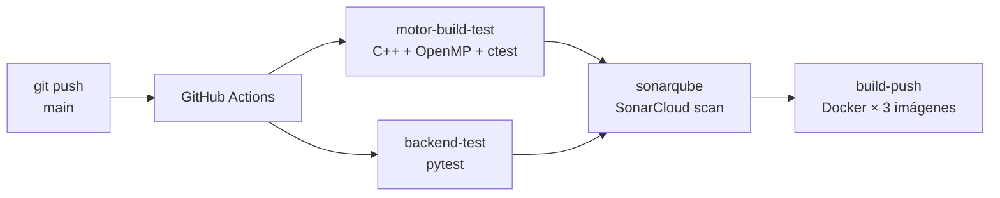

# 06 — CI/CD y Calidad de Código

## Pipeline completo



## Workflow 1: CI — Build, Test & SonarQube

Archivo: [`.github/workflows/ci.yml`](../.github/workflows/ci.yml)

```yaml
name: CI — Build, Test & SonarQube
on:
  push:
    branches: [main, master]
  pull_request:
    branches: [main, master]

jobs:
  motor-build-test:
    runs-on: ubuntu-22.04
    steps:
      - uses: actions/checkout@v4
      - name: Install OpenMP & CMake
        run: sudo apt-get install -y cmake libgomp1 gcc g++
      - name: Configure CMake
        run: cmake -B build -DCMAKE_BUILD_TYPE=Release
        working-directory: motor
      - name: Build
        run: cmake --build build --parallel 4 --target mancala_server mancala_bench test_board
        working-directory: motor
      - name: Run unit tests
        run: ctest --output-on-failure
        working-directory: motor/build
      - name: Benchmark
        working-directory: motor
        run: |
          OMP_NUM_THREADS=1 ./build/mancala_bench --depth 6 --positions tests/suite.txt
          OMP_NUM_THREADS=4 ./build/mancala_bench --depth 6 --positions tests/suite.txt

  backend-test:
    runs-on: ubuntu-22.04
    steps:
      - uses: actions/checkout@v4
      - uses: actions/setup-python@v5
        with:
          python-version: "3.12"
      - run: pip install -r requirements.txt
        working-directory: backend
      - run: pytest tests/ -v
        working-directory: backend

  sonarqube:
    needs: [motor-build-test, backend-test]
    runs-on: ubuntu-22.04
    steps:
      - uses: actions/checkout@v4
        with:
          fetch-depth: 0
      - name: SonarQube Scan
        uses: sonarsource/sonarqube-scan-action@v2
        env:
          SONAR_TOKEN: ${{ secrets.SONAR_TOKEN }}
          SONAR_HOST_URL: ${{ secrets.SONAR_HOST_URL }}
```

### Integración SonarQube en YAML (no plugin)

La integración usa `sonarsource/sonarqube-scan-action@v2` declarada directamente en el YAML del workflow. **No** se usa el plugin del marketplace de GitHub. La configuración del proyecto está en [`sonar-project.properties`](../sonar-project.properties).

Los secrets `SONAR_TOKEN` y `SONAR_HOST_URL` se configuran en `Settings > Secrets > Actions` del repositorio.

## Workflow 2: Docker — Build & Push

Archivo: [`.github/workflows/docker-push.yml`](../.github/workflows/docker-push.yml)

```yaml
name: Docker — Build & Push Images
on:
  push:
    branches: [main, master]
    tags: ["v*"]

jobs:
  build-push:
    strategy:
      matrix:
        component: [motor, backend, frontend]
    steps:
      - uses: actions/checkout@v4
      - uses: docker/login-action@v3
        with:
          registry: ghcr.io
          username: ${{ github.actor }}
          password: ${{ secrets.GITHUB_TOKEN }}
      - id: meta
        uses: docker/metadata-action@v5
        with:
          images: ghcr.io/${{ github.repository_owner }}/mancala-${{ matrix.component }}
          tags: |
            type=sha,prefix=,format=short
            type=ref,event=tag
      - uses: docker/build-push-action@v5
        with:
          context: ./${{ matrix.component }}
          push: true
          tags: ${{ steps.meta.outputs.tags }}
```

- **Tag inmutable:** `type=sha` genera tags como `abc1234f` (SHA corto del commit) — nunca mutable
- **No `latest` en producción:** el tag `latest` solo se agrega en branches de desarrollo
- Las imágenes quedan disponibles en `ghcr.io/OWNER/mancala-{component}:{sha}`

## Evidencia de ejecuciones exitosas

*(Incluir capturas de pantalla de GitHub Actions con todos los jobs en verde)*

### Quality Gate de SonarQube

*(Incluir captura de pantalla del dashboard de SonarCloud mostrando Quality Gate: PASSED)*

Métricas esperadas:
- **Bugs:** 0
- **Vulnerabilities:** 0
- **Code Smells:** < 10
- **Coverage:** > 60%
- **Duplications:** < 3%
